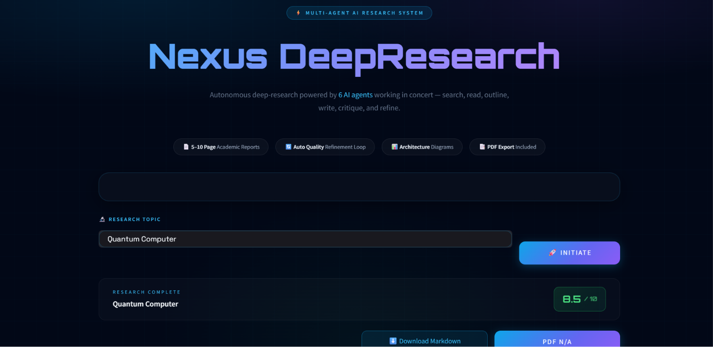

# Nexus DeepResearch - Multi-Agent AI Research System

Nexus DeepResearch is an autonomous, multi-agent AI research pipeline that conducts deep research, outlines, writes, critiques, and refines academic-style reports from a single topic prompt. It generates professional, publication-ready Markdown and PDF documents with embedded architecture diagrams.



## ✨ Features

- **Multi-Agent Architecture**: Uses specialized AI agents working sequentially:
  1. **Searcher**: Scans the global web using Tavily for the latest information.
  2. **Reader**: Deep-reads and scrapes relevant URL content.
  3. **Architect**: Maps out the system architecture and generates flowchart diagrams.
  4. **Outliner**: Plans a structured 4-5 section academic outline.
  5. **Writer**: Iteratively composes each section strictly grounded in the research.
  6. **Critic**: Automatically evaluates the draft against an academic rubric out of 10.
  7. **Refiner**: Improves the draft if the Critic scores it below 8.5/10.

- **Dynamic Visualizations**: Automatically generates System Architecture flowchart diagrams via `matplotlib` and embeds them directly into the UI and PDF.
- **Stunning UI**: A cutting-edge dark-theme Streamlit interface with neon animations, glowing glassmorphic elements, and real-time processing indicators.
- **PDF Export**: Converts the generated Markdown, architecture diagrams, and quality-assurance metrics into a beautifully formatted, multi-page PDF document.
- **Rate-Limit Resilient**: Features smart, rate-limit-aware retry logic that gracefully handles API limits on free tiers.

## 🚀 Quickstart

### Prerequisites
Make sure you have Python 3.10+ installed. This project uses a virtual environment.

1. **Clone the repository** (if applicable).
2. **Activate the virtual environment**:
   ```powershell
   # Windows
   .venv\Scripts\Activate.ps1
   ```
3. **Install dependencies**:
   ```powershell
   pip install -r requirements.txt
   ```
4. **Set up API Keys**:
   Create a `.env` file in the root directory and add your API keys:
   ```env
   GROQ_API_KEY="your_groq_api_key"
   TAVILY_API_KEY="your_tavily_api_key"
   ```

### Running the App
Run the Streamlit server:
```powershell
streamlit run app.py
```
Open the provided `localhost` URL in your browser.

## 🛠 Technology Stack

- **Frontend/UI**: [Streamlit](https://streamlit.io/) with custom CSS animations and styling.
- **LLM Engine**: [Groq](https://groq.com/) API (using `llama-3.1-8b-instant` for ultra-fast, structured outputs).
- **Agents Framework**: [LangChain Core](https://python.langchain.com/docs/core/) (Prompting, Chains, Output Parsers).
- **Search Tooling**: [Tavily Search API](https://tavily.com/) for intelligent web queries, combined with `BeautifulSoup4` for scraping.
- **Diagram Generation**: [Matplotlib](https://matplotlib.org/) for generating flowchart diagrams via an "Agg" backend.
- **Document Export**: [fpdf2](https://pyfpdf.github.io/fpdf2/) for programmatic PDF rendering.

## ⚠️ Notes on Groq Rate Limits
This tool performs deep research requiring thousands of tokens. If you are using the Free/On-Demand tier of Groq:
- The app uses `llama-3.1-8b-instant` to stay within the 6,000 Tokens Per Minute (TPM) limit.
- If a daily or minute limit is hit, the application gracefully intercepts the error and attempts to deliver the partial PDF of whatever sections were completed.

## 🤝 Contributing

Contributions, suggestions, and feature requests are welcome. Feel free to fork the repository, create a feature branch, and submit a pull request.

If you discover a bug or have an idea for improvement, please open an issue.

---

## 👨‍💻 Author

**Ravikant Bedi**

- B.Tech Computer Science Engineering
- Madan Mohan Malaviya University of Technology (MMMUT), Gorakhpur
- Passionate about AI Agents, LLMs, Generative AI, Cybersecurity, and Full-Stack Development.

---

## 📬 Contact

For collaborations or project inquiries, feel free to connect:

- GitHub: https://github.com/RavikantBedi
- LinkedIn: https://www.linkedin.com/in/ravikant-bedi-72a362218?utm_source=share_via&utm_content=profile&utm_medium=member_android

---

## © Copyright

Copyright © 2026 Ravikant Bedi.

All Rights Reserved.

This project and its source code are the intellectual property of the author. No part of this repository may be copied, reproduced, modified, redistributed, or used for commercial purposes without prior written permission.